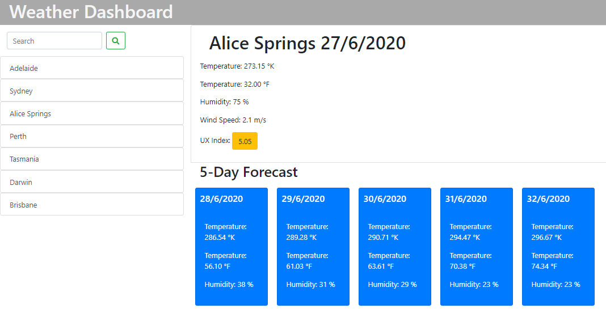

# Weather Dashboard
I created this website application based off an image supplied and user story supplied by Trilogy Education Services. The application allows a user to access the current weather and 5 day forecast from a list of destinations using the [Open Weather Map API](https://openweathermap.org/api/one-call-api). This includes the temperature in Kelvin and Farenheit, humidty, UV Index with a coloured button to represent (favourable, moderate and extreme), wind speed and a weather icon. Throughout creating this application I have thoroughly enjoyed the backend programming and interacting with the object returned from the API.

In comparison with my previous application I initially focused on the CSS styling as this is the area I need to improve in. I am very happy with my final product however there are still some issue I am fixing. Firstly the icons are not linking correctly which I will continue to go over. Secondly the serach button function is not working which is a main component of this assignment therefore I have altered my HTML and JS accordinly so that the other aspects of the user story could be accessed.Due to the search button not functioning correctly the data is unable to be stored locally.

Despite the icons not currently working, in order to access them from the API correctly I consulted the stackoverflow response from a user called [SAMU101108](https://stackoverflow.com/users/6273837/samu101108). Part of his response is shown below:
[Stackoverflow question](https://stackoverflow.com/questions/44177417/how-to-display-openweathermap-weather-icon)
```
    var iconcode = a.weather[0].icon;
    var iconurl = "http://openweathermap.org/img/w/" + iconcode + ".png";
   $('#wicon').attr('src', iconurl);

```
Prior to using the code above I had created an object called icon which contained the different descriptions of the weather eg ("Rain","Clouds","Thunderstorm") with associated values equal to the bootstrap class of an icon matching the description. This creation used up a huge portion of my time with a lot of trial and error. 

The final product of my website is shown below and can be accessed at [Weather Dashboard Application](https://anjkrish2608.github.io/WeatherDashboard/).



## Challenges faced

Throughout the creation of this website I faced many challenges. The greatest challenge I faced was the search button, due to my error in skim reading I focused majority of my week on the function relating to a premade search history. However as I later found out this search list is meant to accumulate after using the button. 

## Credits

Throughout creating this website to ensure correct syntax and resolve any errors [W3Schools.com](https://www.w3schools.com/) was consulted. Furthermore to achieve the final visually apealing application the incredible [Bootstrap](https://getbootstrap.com/docs/4.5/getting-started/introduction/) Application was utilised.

© 2019 Trilogy Education Services, a 2U, Inc. brand. All Rights Reserved.


